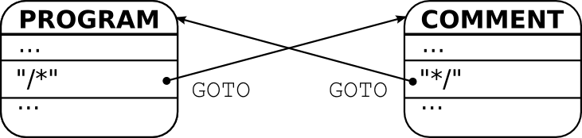

Modes can be changed in two ways: *revertive* and *non-revertive*. A revertive mode
change can be undone. That is the previous mode is retained and can be
re-activated. This is analogous to the call of a function and the return from
it. A non-revertive mode transition does not store the previous mode. It's
analogous to a 'goto' instruction. The syntax for mode transitions is derived
from these analogies. The revertive transition to a mode is triggered by
``GOSUB`` and the return from it by ``GOUP``. The non-revertive transition is
triggered by ``GOTO``.

.. _fig:mode-transition-non-revertive:

   
   Non-revertive mode transition via ``GOTO``.

Figure :ref:`fig:mode-transition-non-revertive` shows an example where a
'TEXT' mode transits to a 'COMMENT' mode. There is no other mode to which the
'COMMENT' mode could transit. Thus, there is no need to retain the information
about the previous mode. When a ``/*`` occurs, then the 'TEXT' mode transits to
the 'COMMENT' mode and when a ``*/`` occurs, the 'COMMENT' mode transits back
to toe 'TEXT' mode. All mode transitions rely on the ``GOTO`` command. The two
modes are written in Quex as

.. code-block:: cpp

   mode TEXT {
      ...
      "/*" => GOTO(COMMENT);
      ...
   }

   mode COMMENT {
      ...
      "*/" => GOTO(TEXT);
      ...
   }

Figure :ref:`fig:mode-transition-revertive` shows a case where a 'COMMENT'
mode is entered possibly from different modes: 'TEXT' and 'MATH'. Both modes
are equally entered via ``GOSUB``. Thus, the history of previous mode
transitions must be retained. When a comment starter ``/*`` appears in the
'MATH' mode, it transits to 'COMMENT' mode. The comment mode, in turn, transits
back to the previous mode upon a comment closing pattern ``*/``--without
explicitly stating what the previous mode was. The return to the previous mode
happens with the ``GOUP`` command. The 'TEXT' and 'MATH' modes are also
activated by ``GOSUB``. An internal mode stack keeps track of previous modes
and takes care that the ``GOUP`` command triggers the correct transition. 

.. _fig:mode-transition-revertive:

.. figure:: ../figures/mode-transition-revertive.png
   
   Non-revertive mode transition via ``GOSUB`` and ``GOUP``.

The three modes in source code are

.. code-block:: cpp

   mode TEXT {
      ...
      "/*" => GOSUB(COMMENT);
      "$"  => GOSUB(MATH);
      ...
   }

   mode MATH {
      ...
      "/*" => GOSUB(COMMENT);
      "$"  => GOUP();
      ...
   }

   mode COMMENT {
      ...
      "*/" => GOUP();
      ...
   }

Revertive mode transitions enable the definition of sub-languages in isolation.
A sub-language can then be embedded into different other languages. It can
return to the embedding language by ``GOUP`` without known what it was. 

.. warning::

   Revertive mode transitions bear the potential of infinite recursions!
   To avoid that, it must be assured that no path along ``GOSUB`` commands
   reaches a node along the path itself.

TODO: Passing tokens along with ``GOSUB``, ``GOUP``, and ``GOTO``.

