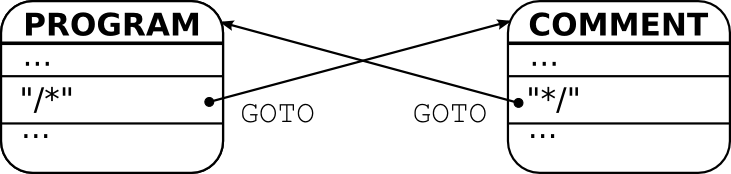
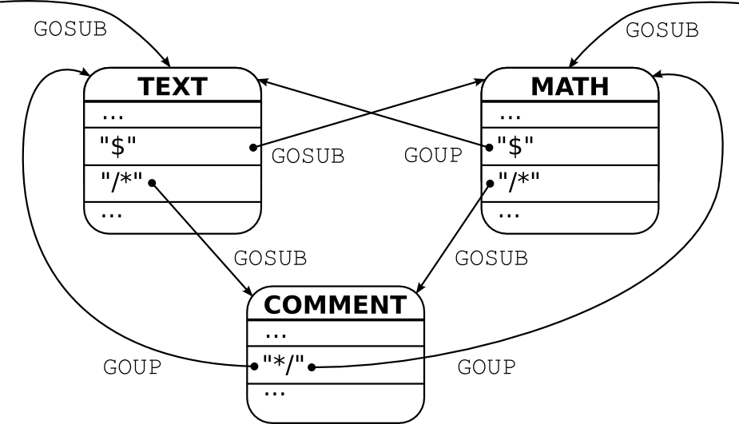

Transitions
===========

Modes can be changed in two ways: *revertive* and *non-revertive*. A revertive mode
change can be undone. That is the previous mode is retained and can be
re-activated. This is analogous to the call of a function and the return from
it. A non-revertive mode transition does not store the previous mode. It's
analogous to a 'goto' instruction. The syntax for mode transitions is derived
from these analogies. The revertive transition to a mode is triggered by
``GOSUB`` and the return from it by ``GOUP``. The non-revertive transition is
triggered by ``GOTO``.

.. _fig:mode-transition-non-revertive:

   
   Non-revertive mode transition via ``GOTO``.

Figure :ref:`fig:mode-transition-non-revertive` shows an example where a
'TEXT' mode transits to a 'COMMENT' mode. There is no other mode to which the
'COMMENT' mode could transit. Thus, there is no need to retain the information
about the previous mode. When a ``/*`` occurs, then the 'TEXT' mode transits to
the 'COMMENT' mode and when a ``*/`` occurs, the 'COMMENT' mode transits back
to toe 'TEXT' mode. All mode transitions rely on the ``GOTO`` command. The two
modes are written in Quex as

.. code-block:: cpp

   mode TEXT {
      ...
      "/*" => GOTO(COMMENT);
      ...
   }

   mode COMMENT {
      ...
      "*/" => GOTO(TEXT);
      ...
   }

Figure :ref:`fig:mode-transition-revertive` shows a case where a 'COMMENT'
mode is entered possibly from different modes: 'TEXT' and 'MATH'. Both modes
are equally entered via ``GOSUB``. Thus, the history of previous mode
transitions must be retained. When a comment starter ``/*`` appears in the
'MATH' mode, it transits to 'COMMENT' mode. The comment mode, in turn, transits
back to the previous mode upon a comment closing pattern ``*/``--without
explicitly stating what the previous mode was. The return to the previous mode
happens with the ``GOUP`` command. The 'TEXT' and 'MATH' modes are also
activated by ``GOSUB``. An internal mode stack keeps track of previous modes
and takes care that the ``GOUP`` command triggers the correct transition. 

.. _fig:mode-transition-revertive:

   
   Non-revertive mode transition via ``GOSUB`` and ``GOUP``.

The three modes in source code are

.. code-block:: cpp

   mode TEXT {
      ...
      "/*" => GOSUB(COMMENT);
      "$"  => GOSUB(MATH);
      ...
   }

   mode MATH {
      ...
      "/*" => GOSUB(COMMENT);
      "$"  => GOUP();
      ...
   }

   mode COMMENT {
      ...
      "*/" => GOUP();
      ...
   }

Revertive mode transitions enable the definition of sub-languages in isolation.
A sub-language can then be embedded into different other languages. It can
return to the embedding language by ``GOUP`` without known what it was. 

.. warning::

   Revertive mode transitions bear the potential of infinite recursions!
   To avoid that, it must be assured that no path along ``GOSUB`` commands
   reaches a node along the path itself.

   The size of the mode stack is constant and configured by the macro
   ``QUEX_SETTING_MODE_STACK_SIZE``.

If a token is to be sent along a mode change, it can be passed as an argument.
The argument passed along the mode transition command follows the same syntax
as it in token sending.  For example,

.. code-block:: cpp

    "%%" => GOSUB(COMMENT, QUEX_TKN_COMMENT_BEGIN);

transits to 'COMMENT' and sends ``QUEX_TKN_COMMENT_BEGIN``. Passing, for
example, the lexeme along a ``GOUP`` is done by,

.. code-block:: cpp

    [a-z]+ => GOUP(QUEX_TKN_IDENTIFIER(Lexeme));

The ``GOTO`` command may carry a second argument for the token to be sent in
the same way as ``GOSUB`` does.  Transitions can be restricted by means of mode
tags. This allows for a safe design of mode transitions. The mode tags are the
following

.. data::  <exit: M0 M1 ... MN>      

   Restricts the set of modes towards the mode may exit to ``M0``, ``M1``,
   until ``MN``. An empty list specifies that the mode cannot be left. If the
   ``exit`` tag is not present, the mode may be left towards any mode.

.. data::  <entry: M0 M1 ... MN>      

   Restricts to set of modes from where the mode may be entered  to ``M0``,
   ``M1``, until ``MN``.  An empty list specifies that the mode cannot be
   entered. If the ``entry`` tag is not present, the mode may be entered from
   any mode.
   
.. note::

   The usage of entry and exit tags is not mandatory. The specification of mode
   transitions in that way, however, supports a proper design. Quex detects
   inconsistencies and, in that case, exits with an error message. 

Two incidence handlers can be specified related to mode transitions:

.. data:: on_entry

    Implicit Argument: ``FromMode``

    Incidence handler to be executed on entrance of the mode. This happens as a
    reaction to mode transitions. ``FromMode`` is the mode from which the
    current mode is entered.

.. data:: on_exit

    Implicit Argument: ``ToMode``

    Incidence handler to be executed on exit of the mode. This happens as a
    reaction to mode transitions. The variable ``ToMode`` contains the mode to
    which the mode is left.
    
The implicit arguments ``FromMode`` and ``ToMode`` are pointers to objects of
type ``QUEX_NAME(Mode)``.  The incidence handlers are independent of pattern
matching. They are not able to directly report a token. Thus, tokens in mode
transition handlers can only be sent, if the token policy 'queue' (see section
:ref:`sec:token-policy`) is applied. The following code fragment demonstrates
the usage of entry and exit tags together with ``on_entry`` and ``on_exit``
handlers.

.. code-block:: cpp

   mode TEXT : 
      <entry: COMMENT> 
      <exit:  COMMENT> 
   {
      on_exit  { printf("exit:  TEXT; to    %s;\n", ToMode->name); }
      on_entry { printf("entry: TEXT; from: %s;\n", FromMode->name); }
      ...
      "/*"   => GOTO(COMMENT);
      ...
   }

   mode COMMENT : 
       <entry: TEXT> 
       <exit:  TEXT> 
   {
      on_exit  { printf("exit:  TEXT; to    %s;\n", ToMode->name); }
      on_entry { printf("entry: TEXT; from: %s;\n", FromMode->name); }
      ...
      "*/"   => GOTO(TEXT);
      ...
   }

Both modes 'TEXT' and 'COMMENT' mutually enter themselves. Upon entry they
print their name and the mode towards they leave, and respectively, the mode
from where they are entered.

