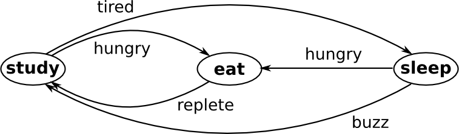
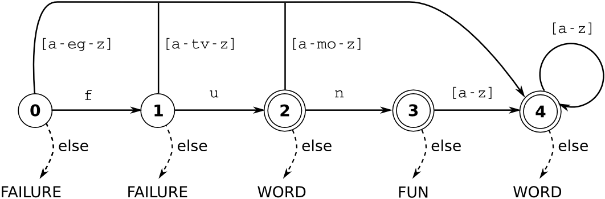
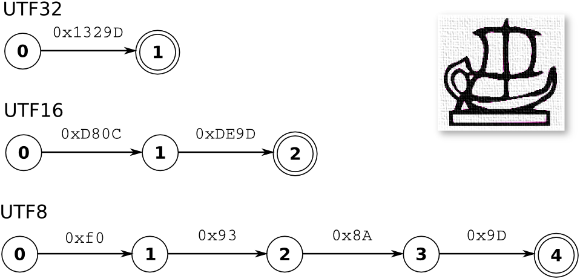

Lexical Analyzers
=================

The following paragraphs elaborate on the significance of sequential data
streams for communication. They provide a rationale for the state machine
approach as a basis for analysis and the reason why Quex implements 'greedy
match'.  Finally, a very essential definition is done, namely that of a
'lexatom'.

Pictures may convey complex ideas very efficiently. They require, however, that
the content is imaginable and that the relations between objects and their
graphical representation are properly understood.  The information of a picture
is perceived in quasi-parallel; all at once. For the image oriented human mind
pictures are something very tangible.

Words and phrases are a means of sequential communication. They require
knowledge of the language being used.  However, the range of describable things
extends beyond the set of known objects and their representation. New words and
constructions may be defined.  The range of describable objects even exceeds
what is imaginable. 

In pictures, two dimensional cohesive patterns such as circles, pyramids, or
arrows identify basic elements. Precise definitions of such elements are
generally  difficult and prone to misunderstandings. For example, consider the
effort to describe precisely how to distinguish between a triangle to mean
pyramid or to mean a hat. In sequential communication, the only possible
cohesive structure is a subsequence. If the set of elements in the stream is
finite, short precise formal definitions can be accomplished. A number, for
example, can be defined as "an aggregation of digits"  and a word can be
defined as "an aggregation of letters". With such atomic categories of meaning,
grammars can be build--grammars which can be recursive. Similar to the way that
recursive formulas allow the definition of the set of rational numbers,
grammars allow for an arbitrary descriptive precision.  This is the strength of
sequential communication (and this is the reason why the command line is more
powerful than GUIs).

The aforementioned two advantages of arbitrary precision through grammar and
the ability to effectively describe precise patterns make sequential
communication the natural choice for the transportation of information over
space and time. The present text deals with automatic text analysis.  The
ability to describe patterns in brief formal terms is essential for developing
algorithms to accomplish the task. In the following paragraphs, it is shown how
state machines are used as formal expressions for pattern matching behavior.

Figure :ref:`fig:state-machine-students-life` may be considered as an informal
introduction to state machines. It displays a, slightly idealized, state
machine description of a student's daily life. His states are 'study', 'eat',
and 'sleep' as they are shown as names framed by ellipses. The transitions
between those states are triggered by him becoming hungry, replete, tired, and
an alarm clock that buzzes. The events are shown as annotations to the arrows
indicating state transitions.

.. _fig:state-machine-students-life:

   
   Description of a student's life in terms of a state machine.

A state machine consists of a set of *states*, *state transition rules*, and
*actions* that are applied upon transitions :cite:`todo`.  A state in the
state machine can be either *active* or *inactive* indicating its ability to react
to incoming events. A state's transition behavior is specified in terms of a
transition map.

Transition Map
   A transition map is related to a single state. It associates an event with a
   successor state (or states). That is, when the event arrives and the state is
   active, it causes the current state to become *inactive* and the successor
   state (or states) to become *active*. 
   
If a state is active, then its transition map determines what state becomes
active as reaction to the next incoming event.  A special state machine is the
'finite state machine' :cite:`todo` FSM.  In a FSM there is only one state
active at a time, called the *current state*. This implies that there is no
transition on the 'no event' and the transition maps associate an event with a
distinct successor state. Quex generates FSMs [#f1]_. 

A simplified view in the frame of pattern matching is expressed in terms of a
'deterministic finite automaton' DFA :cite:`todo`. In a DFA, there is one
category of states which are special: acceptance states. The entry action of an
acceptance state accepts a pattern, i.e. it signalizes a match. Quex generated
analyzers can be imagined as DFAs (but in reality, sometimes the transition
actions are more than just about accepting).

.. _fig:state-machine-for-pattern-matching:

   
   Pattern matching via DFA.

For pattern matching the data from the sequential stream are taken as events to
the state machine.  Figure :ref:`fig:state-machine-for-pattern-matching` shows
a state machine graph, where a circle represents a state and the arrows
possible state transitions. A double circle indicates an acceptance state.  The
depicted state machine can detect the word 'fun'. Any aggregation of two or
more lowercase letters is identified as a 'WORD'.  A sequence of characters
'f', 'u', and 'n' guides from the initial state to state 3. Any non-letter in
that state would cause an else transition, notifying that 'FUN' has been found.
A longer sequence such as 'fund' would be considered a 'WORD' because the
transitions continue to state 4.  A sequence of less than two characters drops
out either at state 0 or state 1.  The 'else' path says that in that case a
'FAILURE' would be notified. 

Quex's engines do 'greedy match' or longest match, that is the analyzer tries
to 'eat' a maximum of letters until it fails. It walks along the state machine
graph according to the incoming characters, marks the acceptance of the last
acceptance state that it passed by, and eventually drops-out. Upon drop-out, it
recalls the last acceptance indicating the longest match. 

Contrary to that, the 'shortest match' terminates upon hitting the first
acceptance state. That approach, however, can only match a subset of pattern
configurations of what the longest match approach may match. Whenever a 
pattern matches a superset of another, the approach fails in favor of the 
shorter pattern. Thus, when 'for' and 'forest' were keywords to be detected, 
the analyzer would always stop at 'for' and never recognize a 'forest'. It
follows that the 'greedy match' approach is obligatory for a general
pattern match solution.

In times of ASCII encoding, there never was a problem calling the events that
cause state transitions 'characters'. Due to the fact that Quex can also
generate engines that work on other character encodings. In some encodings,
such as UTF8 or UTF16, a character may be made up of more a varying number of
bytes or double-bytes. The state machine transitions trigger then no longer on
characters but on sub-chunks that make up those characters. In these cases, the
term 'character' has led to a great deal of confusion. 

Lexatom
   A lexatom is one element in a sequence of data that make up the
   representation of a character. It is an integer value that describes an
   event in a pattern matching state machine. 

.. _fig:lexatom-explanation:

   
   Egyptian Hieroglyph P002 and lexatoms according to UTF32, UTF16, and UTF8.

In an ASCII text, every character is made up out of a single byte which carries
a single character. In that case, a lexatom is the ASCII value of a character.
When dealing with Unicode and its encodings things are not that trivial.
Figure :ref:`fig:lexatom-explanation` shows the example of a Unicode character:
the Egyptian Hieroglyph P002. When the state machine runs on Unicode (UTF32)
there is only one lexatom given as '0x1329D'. The cells that carry lexatoms may
be 4 byte wide. When the dynamic length encoding UTF16 is used, the character
is represented by two lexatoms '0xD80c' followed by '0xDE9E'. Then, a cell
carrying a lexatom must be at least 2 byte wide. In UTF8, the same character is
represented by a sequences of lexatoms namely '0xF0',  '0x93', '0x8A', and
'0x9D' which can be carried in bytes. 

The term 'lexatom' has been introduced by the author of this text. Its name,
though, is derived from an established term in computer science: the lexeme
[#f2]_ . Following the definition in :cite:`Aho2007compilers` (p. 111), let this term be
defined more precisely. 

Lexeme
    A lexeme is a sequence of lexatoms that matches a pattern associated 
    with a category of meaning.

Lexatoms are stored as a sequence in a buffer, so that they can be accessed
quickly by the analyzer. Loading greater chunks of lexatoms into a buffer is
likely always much faster than loading each lexatom on its own. Given a pointer
``p`` to a lexatom-carrying cell of a buffer and a variable ``v`` to carry the
value, a state machine event is implemented as a sequence of the following
instructions:

   #. Increment ``p``, if current state ≠ initial state.

   #. Set ``v`` = content of cell to where ``p`` points. 

With the value of the stored in ``v`` the transition map determines the
successor state.  In this section it has been discussed how lexical analysis is
established.  The term lexatom was introduced because not all state machines
trigger on characters. Eventually, the necessity of of a buffer was
discussed which holds lexatoms ready for analysis. The next section discusses
how lexatoms are filled into that buffer.

.. rubric:: Footnotes

.. [#f1] Indeed, Quex first produces a so called NFA that combines all
         concurrent pattern matches in one single state machine. Then, 
         it applies powerset construction :cite:`Rabin:1959:FAD` to generate 
         a state machine where only one state is active at a time.
.. [#f2] The computer science expression 'lexeme' corresponds to a 'form of
         a lexeme' in linguistics.
