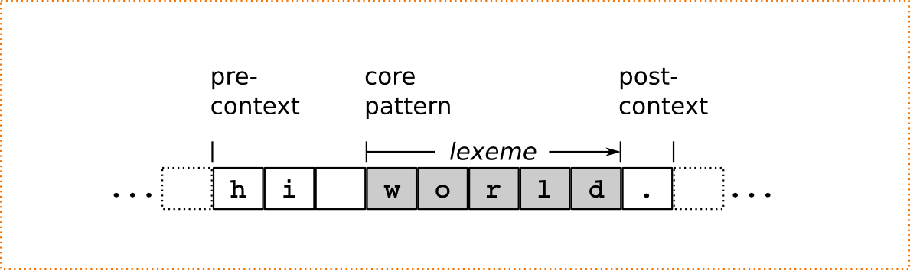

.. _sec:pre-and-post-contexts:

Pre- and Post- Contexts
#######################

This section discusses pre- and post-Contexts restricting the ability of a
pattern to match based on what comes before or after it.  The characters which
match the pre- and post-contexts are themselves not part of the matching
lexeme.  Pre-context trigger investigations backwards on content that has
already been passed. Post-context match behind the core pattern without
consuming anything.

Figure :ref:`pre-and-post-context` shows the example of a core pattern
``[a-z]+`` which may only match if specific pre and post contexts are met. 
The pre-context in that example could be ``(hi|hello)[ ]+``, i.e. some greeting
followed by white space. The post-context could be ``"."|"!"``. If the lexical
analysis step starts at the "h", then the pre-context is met by "hi " ,
the core pattern is matched by "world", and the post-context is matched by
".". The lexeme, in that case is solely "world" and the next step will
start at the ".", not behind it.

.. _fig:pre-and-post-context:

   Pre- and post context around a core pattern.
 
To begin with,  the trivial conditions for begin of line and end of
line are discussed.  Then it is shown how to specify regular expressions
may be used to specify the surroundings of the pattern to be matched. The
traditional characters to condition begin and end of line are ``^`` and 
``$``.

.. describe:: ^R 

   a  regular expression ``R``, but only at the beginning of a line. This
   condition holds whenever the scan starts at the beginning of the character
   stream or right after a newline character. It scans only for a single
   newline character (hexadecimal 0A) backwards, independent on how the
   particular operating system codes the newline. 

.. describe:: R$ 

    a regular expression R, but only at the end of a line and *not* at the end
    of the file. The meaning of this shortcut can be adapted according to the
    target operating system. Some operating systems, such as DOS and Windows,
    code a newline as a sequence '\r\n' (hexadecimal 0D, 0A), i.e.  as two
    characters. If you want to use this feature on those systems, you need to
    specify the ``--DOS`` option on the command line (or in your makefile).
    Otherwise, ``$`` will scan only for the newline character (hexadecimal 0A).
    Consequently, if newline is then coded as 0D, 0A, then the first 0D would
    discard a pattern that was supposed to be followed by 0A only.

    If the ``$`` shall trigger at the end of the file, it might be advantageous
    to add a newline at the end of the file by default.

For more sophisticated cases regular expressions can be defined.  Let ``R`` be
the core regular expression, ``Q`` the regular expression of the pre-condition,
and ``S`` the regular expression for the post-condition.

.. describe:: R/S

   matches an ``R``, but only if it is followed by an ``S``. If the pattern
   matches the input is set to the place where ``R``. The part that is
   matched by ``S`` is available for the next pattern to be matched.  ``R``
   is post-conditioned.  
   
   The case where the repeated or optional end of ``R`` matches the beginning
   of ``S`` is handled by a *philosophical cut* to avoid the 'dangerous
   trailing context' :cite:`Paxson1995flex` problem [#f1]_. The 'philosophical
   cut' modifies the post context, so that the core pattern matches as long as
   possible. This is in accordance with the longest match, which is Quex's
   philosophy of analysis.
		 
.. describe:: Q/R/ 

    matches ``R`` from the current position, but only if it is preceded by a
    ``Q``. Practically, this means the analyzer goes backwards in order to
    determine if the pre-condition ``Q`` has matched and then forward to see if
    ``R`` has matched. ``R`` is pre-conditioned.  With pre-conditions there is
    no trailing context problem as with post-conditions above.
                  
.. describe:: Q/R/S 

    matches ``R`` from the current position, but only if the preceding
    stream matches a ``Q`` and the following stream matches an ``S``.
    ``R`` is pre- and post-conditioned.

A post context should never contain an empty path, i.e. match without any
input. This would mean that if there is nothing specific following it is
acceptable--which happens to be always true. Then, the remaining definition of
the post context is redundant.  

Pre- and post contexts are the utmost syntactical unit. This means that they
cannot be logically 'or-ed'.  That is, the match rule::

   A/B  => QUEX_TKN_SOME();          // OK!
   C/D  => QUEX_TKN_SOME();          // OK!

*cannot* be written shortly as

   (A/N)|(C/D) => QUEX_TKN_SOME();   // WRONG!

The reason for that lies in the grammar that is defined internally for regular
expressions. 

.. note::

    There is no syntactic means to catch the post-context 'end-of-stream'.  The
    markers ``<<EOF>>`` and ``<<FAIL>>`` are not available as post context and
    ``$`` does not catch an end of file post context either. 
    
    The only way to catch a pattern at the end of a file is the following. Let
    'X' be the pattern that matches if it is followed by 'end-of-stream.
    Any token read from the stream must be kept delayed by one before it is
    treated. If the current token is not ``TERMINATION``, then the previous
    token may be processed.  Else, if the previous token corresponds to the 'X'
    the according token must be generated manually.

.. rubric:: Footnotes

.. [#f1] The POSIX draft :cite:`ISO1993posix` mentions that text matched by those patterns is
    undefined. The origin of this problem lies in the way state machines are
    treated.  To avoid this a 'stepping backward from the end of the post-condition
    to the end of the core pattern' must be implemented. Quex does exactly
    that, but it needs to modify the state machines sometimes (in which case
    a warning message is issued).
          
